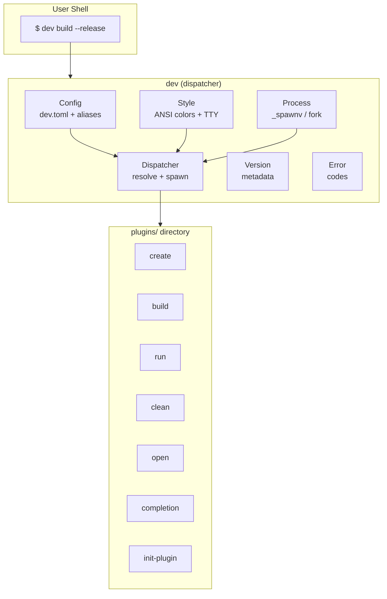
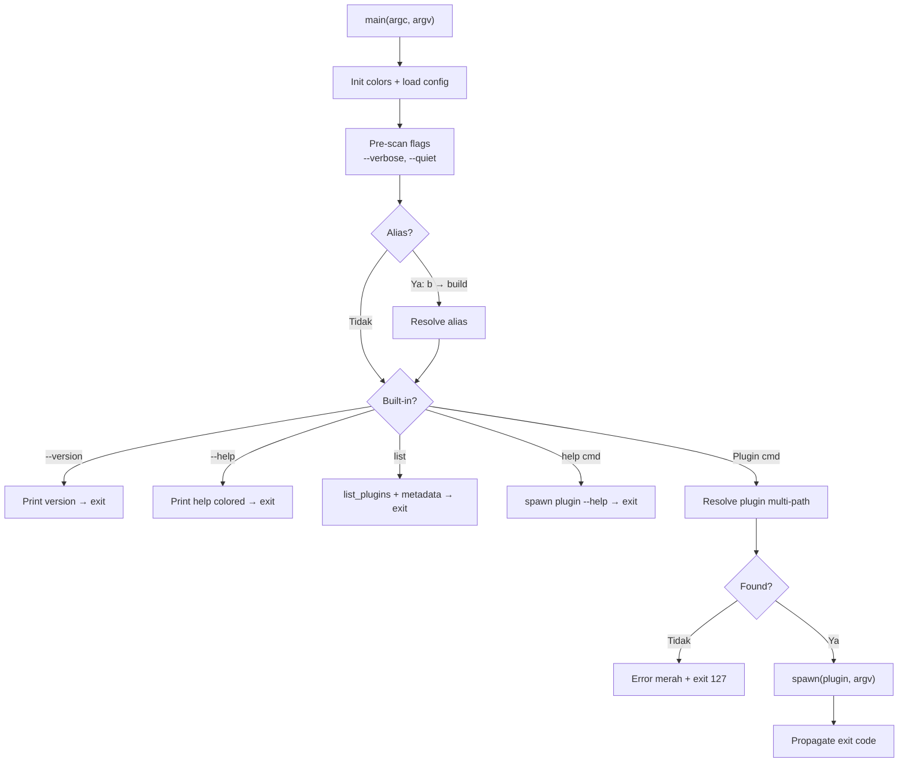
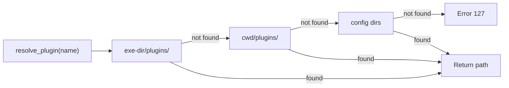
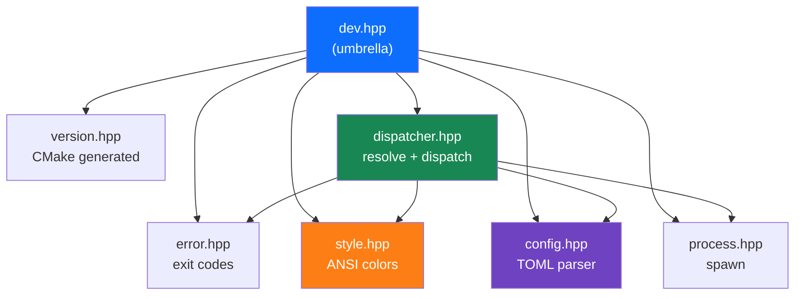
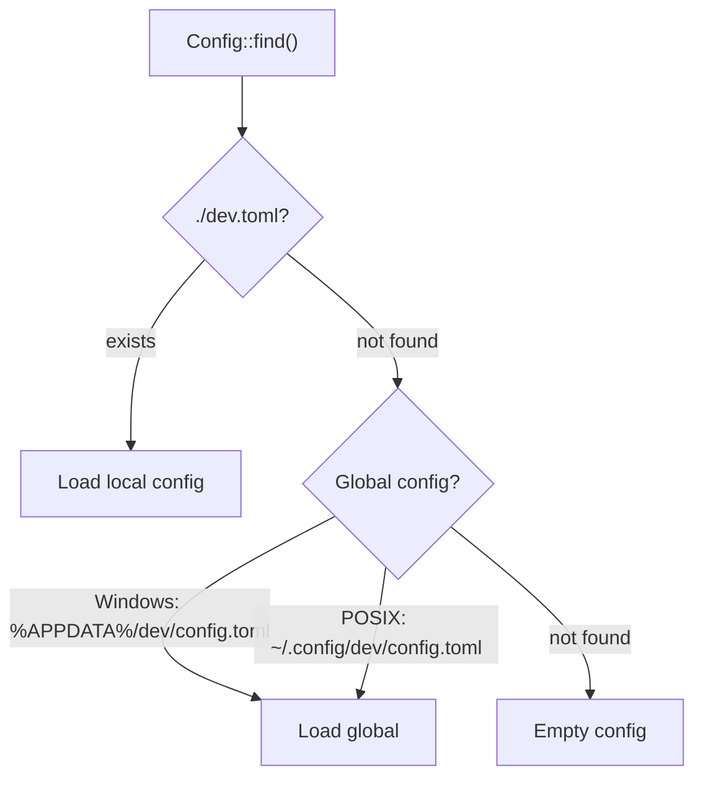
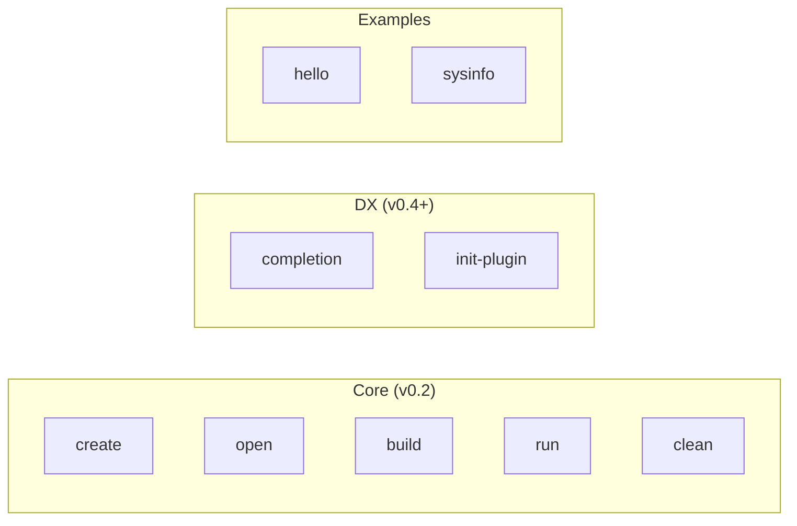
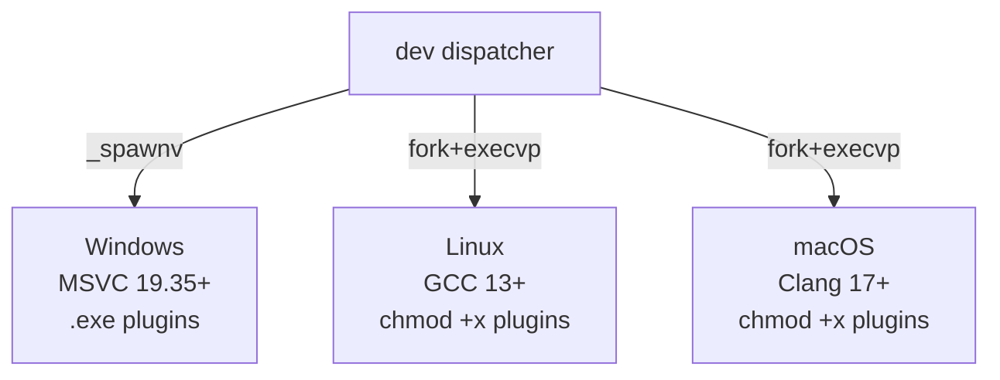

# Arsitektur `dev`

> Dokumen ini menjelaskan arsitektur internal `dev` v1.0.0 — design decisions, komponen, dan alur dispatch.

---

## Filosofi Desain

1. **Single Responsibility** — `dev` hanya *dispatch*. Seluruh logika bisnis ada di plugin.
2. **Zero Coupling** — Plugin tidak perlu link ke library `dev`. Plugin adalah executable mandiri.
3. **Convention over Configuration** — Plugin dikenali dari nama file-nya.
4. **Fail Fast** — Jika command tidak ditemukan, beri pesan error yang jelas (berwarna).
5. **Transparent Forwarding** — Argumen dan exit code diteruskan tanpa modifikasi.

---

## Overview



---

## Alur Dispatch



---

## Plugin Search Order



---

## Komponen Internal

### Header Map



### `dev/version.hpp` — Project Metadata

Auto-generated oleh CMake dari `version.hpp.in`:

```cpp
namespace dev {
    constexpr std::string_view version    = "1.0.0";
    constexpr std::string_view author     = "zuudevs";
    constexpr std::string_view build_type = "Release";
}
```

### `dev/error.hpp` — Error Codes

```cpp
namespace dev {
    enum class Error {
        InvalidUsage     = 2,
        PermissionDenied = 126,
        CommandNotFound  = 127,
    };
}
```

### `dev/style.hpp` — Terminal Colors

- `style::init()` — enable Windows VT + detect TTY
- `style::bold_text("text")` — styled string (plain jika piped)
- Colors: `red`, `green`, `yellow`, `cyan`, `gray`, `dim`, `bold`

### `dev/config.hpp` — Configuration

Parser INI/TOML-like untuk `dev.toml`:
- `Config::find(argv0)` — search `./dev.toml` → global config
- `Config::get(section, key)` / `get_list()` / `get_section()`

### `dev/process.hpp` — Process Spawning

- **Windows:** `_spawnv(P_WAIT, ...)`
- **POSIX:** `fork()` + `execvp()` + `waitpid()`

### `dev/dispatcher.hpp` — Plugin Discovery

- `find_all_plugin_dirs()` — exe-relative + cwd + config
- `resolve_plugin()` / `list_plugins()` / `dispatch()`

---

## Config Search



---

## Plugin System

### Built-in Plugins



### Plugin Contract

| Requirement | Wajib? | Deskripsi |
|-------------|--------|-----------|
| Executable | ✅ | File harus bisa dieksekusi |
| Nama = Command | ✅ | Nama file (tanpa `.exe`) = command name |
| Exit code | ✅ | `0` sukses, non-zero error |
| `--help` flag | ⭐ | Tampilkan usage info |
| Stderr for errors | ⭐ | Stdout = output, stderr = error |

---

## Cross-Platform


